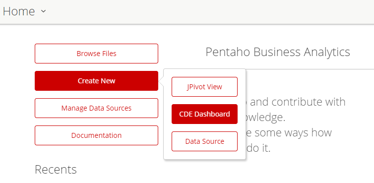
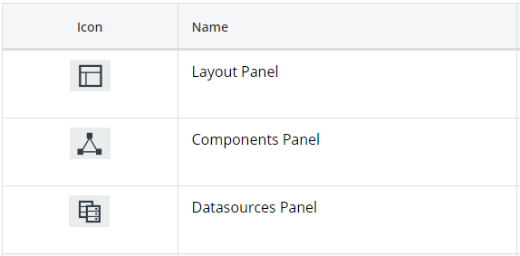

# Guía de LABORATORIO: Introducción a la creación de Dashboard con CDE (Pentaho)

## Introducción a CDE
CDE (Community Dashboard Editor) es la herramienta de la Suite Pentaho para la creación y administración de dashboards. En esta guía vamos a ver un poco de la estructura de esta herramienta y la forma en que podemos utilizarla. Para información mas detallada podés ingresar [acá.](https://help.pentaho.com/Documentation/7.0/0R0/CTools/CDE_Dashboard_Overview)

## Creación de dashboards con CDE
Para ingresar a CDE, debemos hacerlo a través de la Consola de Pentaho, y para ello previamente debemos haber iniciado el Pentaho Server.

Una vez logueados en la Consola de Pentaho, debemos crear un __nuevo CDE Dashboard__:


## Arquitectura de CDE Dashboard
CDE dashboard tiene una arquitectura basada en capas, la cual se puede ver a continuación:


Las capas se explican someramente a continuación:
- __Datasources__: En esta capa se configuran los diferentes orígenes de datos que alimentarán a nuestro dashboard a través de los componentes. Aquí podemos configurar el acceso a datos de diferentes orígenes como bases de datos relacionales, bases de datos NoSQL, archivos de texto, cubos de un datawarehouse a través de consultas MDX y muchas otras fuentes de datos.
- __Components__: En esta capa vamos a configurar los componentes que formarán parte del Dashboard. Cuando hablamos de componentes nos referimos a los diferentes tipos de gráficos, tablas, información, entre otros, que en conjunto forman el dashboard. En resumen, todo lo que está en el dashboard es un componente. Estos componentes consumen la información desde los datasources que creamos antes y para ello debemos vincularlos.
- __Layout__: En esta capa vamos a organizar la visualización de los componentes (configurados antes) que forman el dashboard así como el texto que lo acompaña. Tiene la misma estructura que el layout HTML -en esencia lo es- y podemos combinarlo con CSS.

Si bien es posible configurar las capas en cualquier orden, nosotros iremos desde abajo hacia arriba, primero configuraremos los orígenes de datos en la capa de de datasources, luego crearemos los componentes vinculándolos con los datasources de los cuales obtendrán los datos y por último armaremos el layout del dashboard para organizar los componentes que antes creamos.

## Paso 1: Configurando los datasources de nuestro Dashboard
A continuación podemos ver la pantalla para la vista de la Capa de Datasources donde podemos elegir los orígenes de datos a configurar (sobre la parte izquierda de la pantalla), verificar los datasources definidos (en el centro de la pantalla) y definir los diferentes aspectos del origen de datos (estos aspectos varían de acuerdo al tipo).


En este caso, seleccionamos como origen de datos una consulta a una base de datos relacional -SQL Queries- y nos conectamos a partir de un conector JDBC. En estos casos, como puede verse en la pantalla, debemos configurar:
- Nombre,
- Driver (en este caso org.postgresql.Driver),
- Clave del usuario DB,
- Nombre del usuario DB,
- URL de acceso -mediante el driver- a la Base de datos que vamos a consultar,
- Query con la información que vamos a consultar y alimentar el componente.


Ejemplo: cómo armar un documento JSON para importar a la base.

```javascript
    { 
        "_id": 1,
        "titulo": "Se estrelló un avión en Cuba",
        "cuerpo": "La aeronave cayó a poco de despegar del aeropuerto de La Habana. Era un Boeing 737 de una compañía aérea subsidiaria de Cubana de Aviación. El presidente cubano Miguel Díaz-Canel se dirigió de inmediato al lugar del accidente.",
        "fecha-hora": "2018-05-18 16:00:00"
    }
```

a) Incorporar un documento desde el shell

```javascript
    db.documentos.insertOne({ 
        "_id": 1,
        "titulo": "Se estrelló un avión en Cuba",
        "cuerpo": "La aeronave cayó a poco de despegar del aeropuerto de La Habana. Era un Boeing 737 de una compañía aérea subsidiaria de Cubana de Aviación. El presidente cubano Miguel Díaz-Canel se dirigió de inmediato al lugar del accidente.",
        "fecha-hora": "2018-05-18 16:00:00"
    })
```    

b) Buscar todos los documentos cargados en la colección.
```javascript
    db.documentos.find({})
```

c) Actualizar un atributo con __update__

```javascript
    db.documentos.update(
        {"_id": 1},
        {$set: {"titulo": "NOTICIA MODIFICADA EN DMUBA"}}
    )
```

d) Eliminar un documento de la colección

```javascript
    db.documentos.deleteOne({"_id": 3})
```
    
e) Incorporar varios documentos a través del shell

Con la instrucción db.<mi colección>.insert([{doc1}, {doc2}, ...,])

Ejemplo:

```javascript
    db.documentos.insert(
    [
        
    {
        "_id" : ObjectId("5af98a285987f909b4005ff3"),
        "status_id" : "996013967498776577",
        "created_at" : ISODate("2018-05-14T13:06:49.000Z"),
        "user_id" : "213888080",
        "screen_name" : "Florsube",
        "text" : "@perroscalle  piel de gallina imaginando la situación de Alejandro!cada uno con sus montruos, jajaja, y nosotros preocupados por el dólar y la inflación! tiburón, qué buscas en la orilla?",
        "source" : "Twitter Web Client",
        "reply_to_user_id" : "76727519",
        "reply_to_screen_name" : "perroscalle",
        "is_quote" : false,
        "is_retweet" : false,
```

El dataset de Tweets está disponible [acá](https://raw.githubusercontent.com/dmuba/dmuba.github.io/master/Practicos/guias/tweets-dolar.json).

d) Utilizar operadores de comparación

¿Cuantos tweets tienen más de un retweet?

```javascript

db.getCollection('tweets').find({retweet_count: {$gt: 1} })

```
Ver otros operadores [aquí](https://docs.mongodb.com/manual/reference/operator/query-comparison/)

e) Utilizar búsquedas por cadenas

¿Cuáles usuarios comienzan con P?

    db.getCollection('tweets').find({screen_name: {$regex: "^P.*"} })

