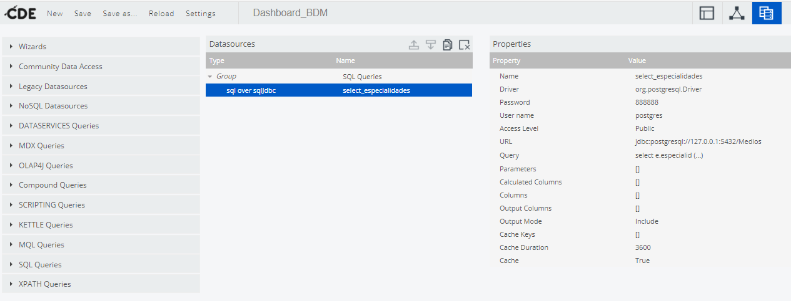
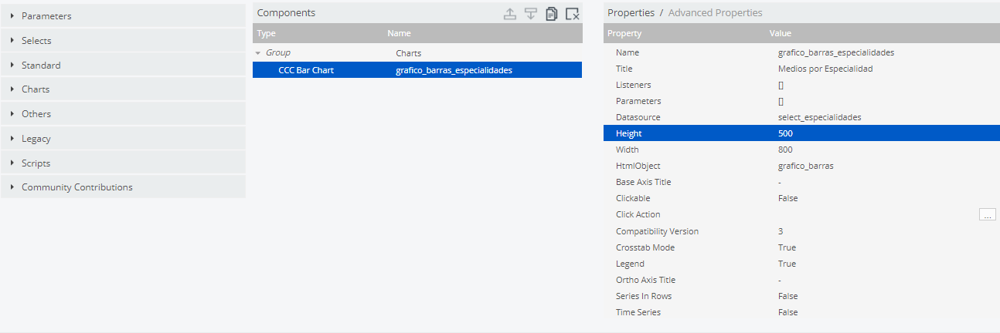

# Guía de LABORATORIO: Introducción a la creación de Dashboard con CDE (Pentaho)

## Introducción a CDE
CDE (Community Dashboard Editor) es la herramienta de la Suite Pentaho para la creación y administración de dashboards. En esta guía vamos a ver un poco de la estructura de esta herramienta y la forma en que podemos utilizarla. Para información mas detallada podés ingresar [acá.](https://help.pentaho.com/Documentation/7.0/0R0/CTools/CDE_Dashboard_Overview)

## Creación de dashboards con CDE
Para ingresar a CDE, debemos hacerlo a través de la Consola de Pentaho, y para ello previamente debemos haber iniciado el Pentaho Server.

Una vez logueados en la Consola de Pentaho, debemos crear un __nuevo CDE Dashboard__:

__Ejemplo de la Guia:__ En esta guía vamos a graficar los conceptos desarrollando un Dashboard muy simple que consistirá en un Gráfico de Barras que consumirá los datos a partir de una Base de Datos Postgresql con la cantidad de medios por especialidad.

## Arquitectura de CDE Dashboard
CDE dashboard tiene una arquitectura basada en capas, la cual se puede ver a continuación:

Las capas se explican someramente a continuación:
- __Datasources__: En esta capa se configuran los diferentes orígenes de datos que alimentarán a nuestro dashboard a través de los componentes. Aquí podemos configurar el acceso a datos de diferentes orígenes como bases de datos relacionales, bases de datos NoSQL, archivos de texto, cubos de un datawarehouse a través de consultas MDX y muchas otras fuentes de datos.
- __Components__: En esta capa vamos a configurar los componentes que formarán parte del Dashboard. Cuando hablamos de componentes nos referimos a los diferentes tipos de gráficos, tablas, información, entre otros, que en conjunto forman el dashboard. En resumen, todo lo que está en el dashboard es un componente. Estos componentes consumen la información desde los datasources que creamos antes y para ello debemos vincularlos.
- __Layout__: En esta capa vamos a organizar la visualización de los componentes (configurados antes) que forman el dashboard así como el texto que lo acompaña. Tiene la misma estructura que el layout HTML -en esencia lo es- y podemos combinarlo con CSS.

Si bien es posible configurar las capas en cualquier orden, nosotros iremos desde abajo hacia arriba, primero configuraremos los orígenes de datos en la capa de de datasources, luego crearemos los componentes vinculándolos con los datasources de los cuales obtendrán los datos y por último armaremos el layout del dashboard para organizar los componentes que antes creamos.

## Paso 1: Configurando los datasources de nuestro Dashboard
A continuación podemos ver la pantalla para la vista de la Capa de Datasources donde podemos elegir los orígenes de datos a configurar (sobre la parte izquierda de la pantalla), verificar los datasources definidos (en el centro de la pantalla) y definir los diferentes aspectos del origen de datos (estos aspectos varían de acuerdo al tipo).

En este caso, seleccionamos como origen de datos una consulta a una base de datos relacional -SQL Queries- y nos conectamos a partir de un conector JDBC. En estos casos, como puede verse en la pantalla, debemos configurar:
- Nombre,
- Driver (en este caso org.postgresql.Driver),
- Clave del usuario DB,
- Nombre del usuario DB,
- URL de acceso -mediante el driver- a la Base de datos que vamos a consultar,
- Query con la información que vamos a consultar y alimentar el componente.

A continuación, vemos el editor del query SQL donde escribimos el query que recuperará la información que volcaremos en nuestro componente; es importante hacer notar que cada componente espera la información de una manera distinta. 

En el caso de los gráficos de barra, que es el ejemplo que vamos a trabajar, el componente espera que le enviemos la información con una lista de etiquetas (leyenda de la barra) y un valor cuantitativo para cada etiqueta (alto de la barra).

## Paso 2: Configurando los componentes de nuestro Dashboard
A continuación podemos ver la pantalla para la vista de la Capa de Componentes, la cual es muy similar a la vista de Datasources: a la izquierda los diferentes tipos de componentes (tablas, gráficos, etc), en el centro los componentes definidos organizados por tipo y a la derecha la configuración de los diferentes aspectos de cada componente (estos aspectos también varían de acuerdo al tipo).

