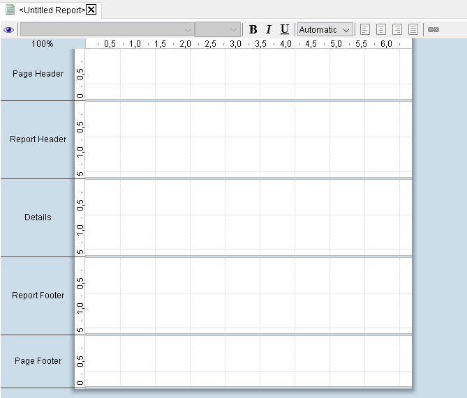
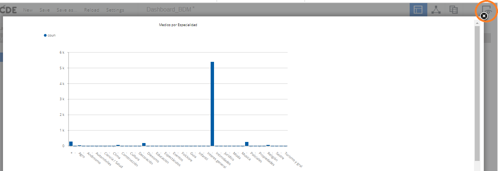

# Guía de LABORATORIO: Introducción a la creación de reportes con Report Designer (Pentaho)

## Introducción a Report Designer
Report Designer es la herramienta de reporting de la Suite Pentaho y es utilizada para la creación de reportes ad hoc. Dado que la definición de la estructura del reporte se realiza de forma separada de la definición de los datos del contenido, tiene la ventaja con respecto a los reportes ad hoc tradicionales que cualquier modificación en el origen de datos será reflejada en el informe de forma automática. Podemos acceder a información mas detallada de la herramienta ingresando [acá.](https://help.pentaho.com/Documentation/8.1/Products/Report_Designer)

## Creación de Reportes con Report Designer
Para ingresar a Report Designer, debemos descomprimir la carpeta descargada desde la web de [Hitachi Vantara](https://community.hitachivantara.com/docs/DOC-1009856-pentaho-reporting) y ejecutar el archivo report-designer (.sh en Ubuntu y .bat en Windows) luego de configurar la variable JAVA_HOME como se explica [aquí.](https://www.dropbox.com/s/au05tj4qn63h8xx/GL00%20-%20Gu%C3%ADa%20de%20Instalaci%C3%B3n%20Suite%20Pentaho.pdf?dl=0)

En la imagen se puede ver la distribución del home de la herramienta:
- A la izquierda, los diferentes componentes que podemos incorporar en nuestro reporte.
- En el centro, el paño en blanco que representa nuestro reporte y es donde vamos a incorporar los componentes y las definiciones.
- A la derecha podemos encontrar una columna con dos pestañas:
  - La primera, "Structure", donde podemos ver los componentes definidos para cada sección de nuestro reporte y definir todas las cuestiones inherentes al formato.
  - La segunda, "Data", donde vamos a definir los orígenes de datos desde los cuales vamos a consumir la información para los reportes.

__Ejemplo de la Guia:__ En esta guía vamos a graficar los conceptos desarrollando un reporte que liste y grafique todos los medios de la provincia de Córdoba.

## Estructura de un Reporte
Los reportes en general, y en Report Designer en particular, tienen las siguientes secciones:

Las secciones se explican a continuación:
- __Page Header & Footer:__ Estas dos secciones representan los típicos encabezados y pies de páginas y suelen no modificarse a lo largo de un informe. En general, se utilizan para incorporar los logos institucionales, nombres de las áreas, números de páginas, fecha, etc.
- __Report Header, Details & Footer:__ Estas tres secciones son utilizadas para organizar los elementos de cada reporte. En general, el encabezado es utilizado para explicar la misión del reporte con un título y una breve explicación, mientras que en details puede observarse información desagregada, generalmente a partir de una tabla o detalle a la vez que en el pie del reporte generalmente se presenta algún gráfico que pueda sintetizar esa información o complementarla.

## Paso 1: Configurando los datasources de nuestro Reporte
A continuación podemos ver la pantalla para la vista de la Capa de Datasources donde podemos elegir los orígenes de datos a configurar (sobre la parte izquierda de la pantalla), verificar los datasources definidos (en el centro de la pantalla) y definir los diferentes aspectos del origen de datos (estos aspectos varían de acuerdo al tipo).

En este caso, seleccionamos como origen de datos una consulta a una base de datos relacional -SQL Queries- y nos conectamos a partir de un conector JDBC. En estos casos, como puede verse en la pantalla, debemos configurar:
- Nombre,
- Driver (en este caso org.postgresql.Driver),
- Clave del usuario DB,
- Nombre del usuario DB,
- URL de acceso -mediante el driver- a la Base de datos que vamos a consultar,
- Query con la información que vamos a consultar y alimentar el componente.

A continuación, vemos el editor del query SQL donde escribimos el query que recuperará la información que volcaremos en nuestro componente; es importante hacer notar que cada componente espera la información de una manera distinta. 

En el caso de los gráficos de barra, que es el ejemplo que vamos a trabajar, el componente espera que le enviemos la información con una lista de etiquetas (leyenda de la barra) y un valor cuantitativo para cada etiqueta (alto de la barra).

## Paso 2: Configurando los componentes de nuestro Dashboard
A continuación podemos ver la pantalla para la vista de la Capa de Componentes, la cual es muy similar a la vista de Datasources: a la izquierda los diferentes tipos de componentes (tablas, gráficos, etc), en el centro los componentes definidos organizados por tipo y a la derecha la configuración de los diferentes aspectos de cada componente (estos aspectos también varían de acuerdo al tipo).

Aquí debemos configurar, para nuestro gráfico de barras (CCC Bar Chart) debemos configurar, entre otros:
- Nombre,
- Título que aparecerá arriba del gráfico,
- Datasource (origen de los datos que consumirá el componente),
- Ancho & alto,
- HtmlObject: esto es, el sector del dashboard donde se visualizará el componente y para ello, en la capa de Layout, debemos definir que uno de los sectores del layout tenga como nombre el nombre definido aquí para el objeto html del componente.

## Paso 3: Organizando el layout de nuestro Dashboard
Por último, definiremos la estructura de nuestro dashboard. El layout del dashboard estará organizado, de acuerdo a html, por filas y columnas y, a su vez, y todos los tipos de componentes que ya conocemos para html. 

Aquí debemos configurar, para nuestro gráfico de barras (CCC Bar Chart) debemos configurar, entre otros:
- Nombre (aquí es donde debe coincidir con el nombre definido para HtmlObject del componente),
- Atributos relacionados con el aspecto.

## Previsualizando nuestro Dashboard
Luego, podemos ir previsualizando el aspecto de nuestro dashboard con el ícono que tiene el ojo y hemos marcado con el círculo rojo:

Por último, para los amantes de R, podemos explorar las librerías __flexdashboards__ y __r2d3__ para la definición de dashboards interactivos. Para mas información, podemos empezar por [acá](https://rmarkdown.rstudio.com/flexdashboard/) y [acá.](https://rstudio.github.io/r2d3/articles/introduction.html)
