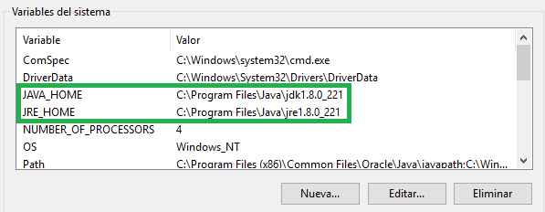
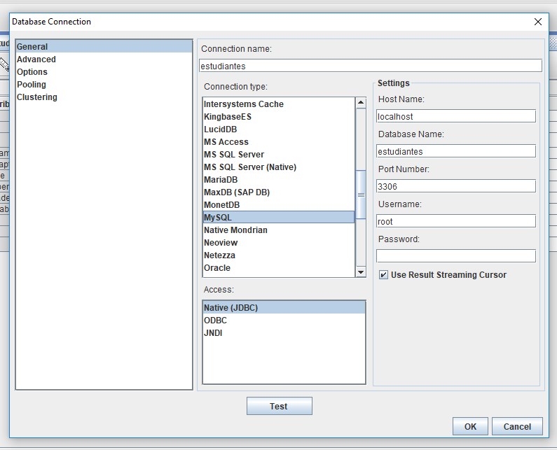
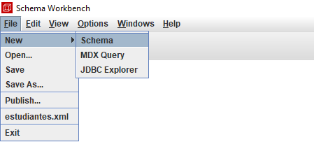
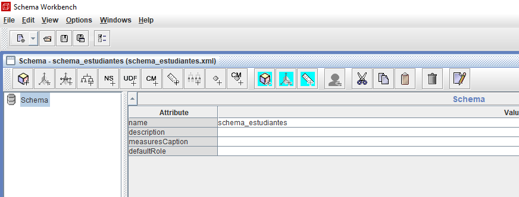
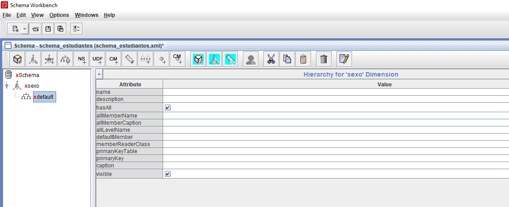
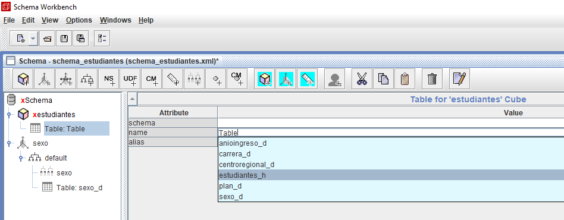
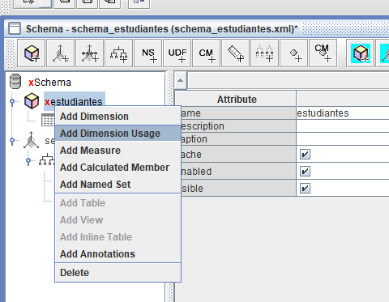
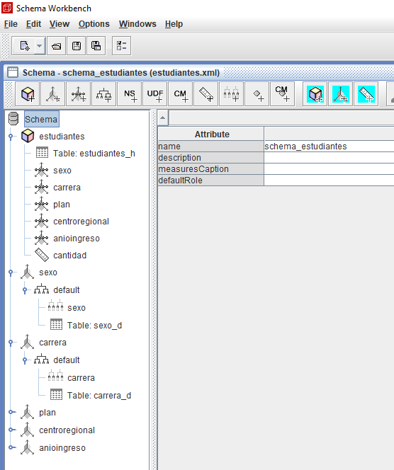
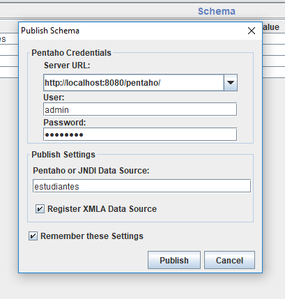
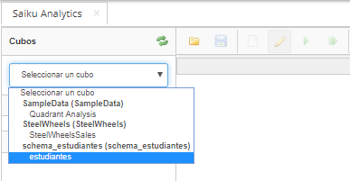

# Guía de LABORATORIO: Definición de cubos multidimensionales con Pentaho Schema Workbench (Mondrian)

## Introducción

Mondrian Schema Workbench es una herramienta con una interfaz visual para crear cubos OLAP. El motor Mondrian luego procesa las solicitudes MDX contra esquemas ROLAP (Relacional OLAP, como vimos en clase). 
La herramienta genera estos esquemas, a través de la denifición de modelos sobre los metadatos del esquema ROLAP en un archivo XML que consta de una estructura específica. Estos modelos XML pueden considerarse estructuras en forma de cubo que utilizan las tablas de hechos y dimensiones que se encuentran en el Sistema Gestor de Base de Datos Relacional utilizado (en el ejemplo que sigue será  MySQL). Como abordamos de forma teórica, los esquemas ROLAP no requieren que se construya o mantenga un cubo físico real; solo se crea el modelo de metadatos, que hace las veces de "cubo lógico".

## Requerimientos

Para empezar con el desarrollo del cubo es necesario:
- Tener java instalado en la máquina (jdk de 64 bits, que ya viene con le jre).
- Configurar las variables de entorno JAVA_HOME (JDK) y JRE_HOME (JRE).
- Descargar Mondrian.
- Instalar alguna base de datos y descargar su correspondiente driver, en este ejemplo se va a utilizar MySQL.

## Configuración de las variables de entorno

## Esquema de la Base de datos

## Aplicación

Para correr el programa desde la consola, hay que ejecutar la siguiente línea

- schema-workbench.bat

----

## Creación de un cubo

Lo primero que hay que configurar es la conexión, en el caso de utilizar otra base de datos, hay que descargar
el correspondiente driver java y colocarlo en la carpeta schema-workbench/drivers

Crear un schema desde la opción File -> New -> Schema

Ponerle un nombre al schema

Ahora vamos a definir una dimensión y ponerle un nombre

Por defecto crea una jerarquía, dejarla sin nombre

Vamos a agregar la tabla que corresponde a esta dimensión

Si la conexión es correcta, nos despliega las tablas de la base de datos

Ahora hay que agregar un nivel

Acá vamos a relacionar la tabla de la dimensión, en el campo column va el identificador y el nameColumn el campo descripción de la tabla

Esto lo hacemos con todas las dimensiones.

En este ejemplo, las dimensiones se agregan fuera del cubo que vamos a agregar porque en esquemas más complejos en los que necesitamos más de un cubo, es probable que necesitemos compartir las dimensiones, las que se definen dentro de los cubos son solamente para el cubo en cuestión

Una vez que terminamos, vamos a agregar el cubo con la tabla de hechos y sus relaciones.

Creamos un cubo y le ponemos el nombre de la tabla de hechos

Creamos una tabla y seleccionamos la tabla de hechos

Ahora vamos a relacionar las dimensiones que creamos anteriormente

Seleccionamos la opcion dimension usage en vez de crear una normal, esto nos permite seleccionar las dimensiones que tenemos disponibles en el esquema

Le ponemos le nombre, seleccionamos la foreign key de la tabla de hechos que apunta a la tabla de la dimensión y en source, seleccionamos la dimensión que creamos anteriormente

Hacemos esto con todas las dimensiones que creamos en el esquema

Lo que falta es definir las medidas que va a tener el cubo, vamos a agregar una que cuente la cantidad de alumnos.

Agregamos una medida

En el campo agregator, seleccionamos la función que se va a calcular para este campo

En el campo column, seleccionamos el campo con el que se va a realizar el cálculo, en este caso como sólo es contar, podría seleccionar cualquiera

Ya tenemos el cubo listo para publicar

Vamos a publicar el cubo

Completamos los datos que apuntan al servidor de Pentaho y publicamos

En Pentaho, aparece el cubo que acabamos de publicar para poder realizar en un análisis

Con la herramienta Saiku, podemos mezclar las dimensiones y ver como se calcula la medida

Incluso podemos hacer gráficos con el mismo cruce de los datos

## Links

Driver MySQL

https://dev.mysql.com/downloads/connector/j/

Java JDK

https://www.oracle.com/java/technologies/jdk8-downloads.html

Mondrian

https://mondrian.pentaho.com/documentation/installation_es.php

https://mondrian.pentaho.com/documentation/workbench.php

https://help.pentaho.com/Documentation/8.1/Products/Schema_Workbench

Pentaho

https://www.hitachivantara.com/go/pentaho.html

https://help.pentaho.com/Documentation/8.1

Saiku

https://saiku-documentation.readthedocs.io/en/latest/
